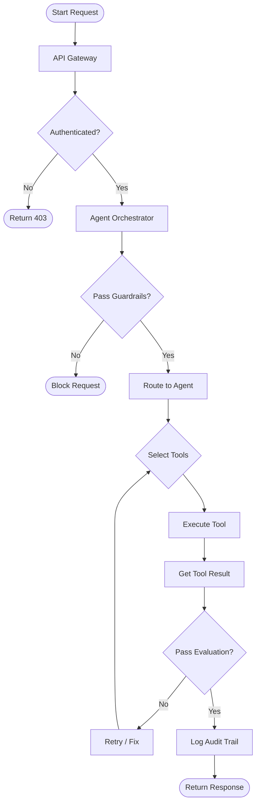

# Enterprise AI Agent Platform (MCP-based)

This project is a **production-grade AI Agent Platform** designed for enterprise workflows. It demonstrates how to safely deploy autonomous AI agents with tools, guardrails, auditability, and human-in-the-loop controls.

Unlike demo chatbots, this system focuses on **reliability, security, and governance** — the hard problems companies actually care about.

---

## 🧠 Philosophy & Core Ideas

*   **Explicit > Implicit**: Clear boundaries between routing, reasoning, and execution.
*   **Systems > Prompts**: AI is probabilistic; the surrounding system must be deterministic.
*   **Agents are Products**: Each agent is domain-specific and self-contained, not just a function.
*   **Auditability**: Every AI action must be traceable.
*   **Human-in-the-Loop**: Human override is a feature, not a failure.

---

## 🏗 High-Level Architecture

The system uses a **modular Agent Orchestrator** to route user intents to specialized agents.

```
Client / CI / Internal Tools
        ↓
FastAPI Gateway (Auth, RBAC)
        ↓
Agent Orchestrator Service
  ├─ Policy Engine (Guardrails)
  ├─ Prompt Registry (Versioned)
  ├─ Tool Router (Permissions)
  ├─ Eval & Validation Layer
        ↓
MCP Agents (Domain Specific)
  ├─ API Test Generation Agent
  ├─ Security Review Agent
  ├─ Compliance & Audit Agent
        ↓
Tools / Artifacts (Tests, Reports, Logs)
```

### Request Flow
1.  **Client** sends request (API/CI).
2.  **Orchestrator** analyzes intent and checks policies.
3.  **Router** selects the best agent (Test, Security, or Compliance).
4.  **Agent** selects tools via the **Tool Router**.
5.  **Tools** execute (with strict schema validation).
6.  **Eval Layer** validates output (JSON schema, rule-based).
7.  **Response** is returned with full audit trail.

---

## 📂 Repo Structure

```
ai-agent-platform/
│
├── api/
│   ├── main.py                 # FastAPI entrypoint
│   ├── auth/                   # OAuth/JWT
│   └── routes/                 # HTTP endpoints
│
├── orchestrator/               # Core Orchestrator Logic
│   ├── orchestrator.py         # Agent selection + execution loop
│   ├── policy_engine.py        # Guardrails & Permissions
│   ├── tool_router.py          # Tool execution & validation
│   ├── eval_engine.py          # Output verification
│   └── audit_logger.py         # Audit trail
│
├── agents/                     # Specialized Agents
│   ├── test_generator/         # Generates Mocha/Chai tests
│   ├── security_reviewer/      # Analyzes specs for risks
│   └── compliance_agent/       # Generates audit reports
│
├── tools/                      # Pluggable Tools
│   ├── swagger_parser.py
│   ├── mongo_reader.py
│   └── repo_writer.py
│
├── prompts/                    # Versioned Prompt Registry
├── schemas/                    # Pydantic Models for I/O
└── storage/                    # Artifacts & Logs
```

---

## 🤖 Agents Included

### 1. API Test Generation Agent
*   **Input**: Swagger/OpenAPI spec, MongoDB schema.
*   **Output**: Mocha + Chai test cases, Faker-based mock data.
*   **Role**: Automates repetitive QA work, ensures coverage.

### 2. Security Review Agent
*   **Input**: API specs, Auth config, Dependencies.
*   **Output**: Report on auth flaws, missing validations, CVEs.
*   **Role**: AI-assisted AppSec review.

### 3. Compliance & Audit Agent
*   **Input**: Agent decisions, logs, tool outputs.
*   **Output**: Human-readable rationale and decision trace.
*   **Role**: Provides explainability for regulators/auditors.

---

## 🚀 Capabilities & Tech Stack

*   **API**: FastAPI
*   **Models**: LLaMA / Ollama / OpenAI-compatible
*   **Orchestration**: Custom Policy Engine + Tool Router
*   **Tools**: MCP-style strict schemas
*   **Auth**: OAuth2 / JWT (Planned)

---

## 🔜 Roadmap & Planned Upgrades

All of the following upgrades are **planned and approved**:

### 1. Dynamic Agent Registry
*   Auto-discover agents via metadata.
*   Enable/disable agents via config.
*   Versioned agents (v1, v2, experimental).

### 2. Tool Auto-Selection
*   Let agents choose tools dynamically with scoring.
*   Detailed tool execution traces.

### 3. Multi-Agent Workflows
*   Chain multiple agents in a single request (e.g., Test Gen -> Security Review).
*   Parallel agent execution (fan-out / fan-in).

### 4. Memory & Context Management
*   Short-term conversational memory.
*   Vector-store backed context (FAISS/Pinecone) for long-running tasks.

### 5. Streaming Responses
*   Token-level streaming to client.
*   SSE/WebSocket support for real-time feedback.

### 6. Observability & Tracing (OpenTelemetry)
*   Per-agent execution logs and cost metrics.
*   Full trace from prompt to tool to result.

### 7. Agent Configuration via YAML
*   Define agent parameters and prompt templates without code changes.

---

## Why This Matters

This project demonstrates **senior-level system design** by answering the question:
> "Can we trust this AI system in production?"

It moves beyond simple chatbots to building **AI-native backend systems** that are reliable, secure, and ready for enterprise deployment.

## Who This Is For

*   AI Platform Engineers
*   Backend Engineers moving into AI
*   Security Engineers working with LLMs
*   Companies building internal AI tooling

---

## 🔄 Request Execution Flow




